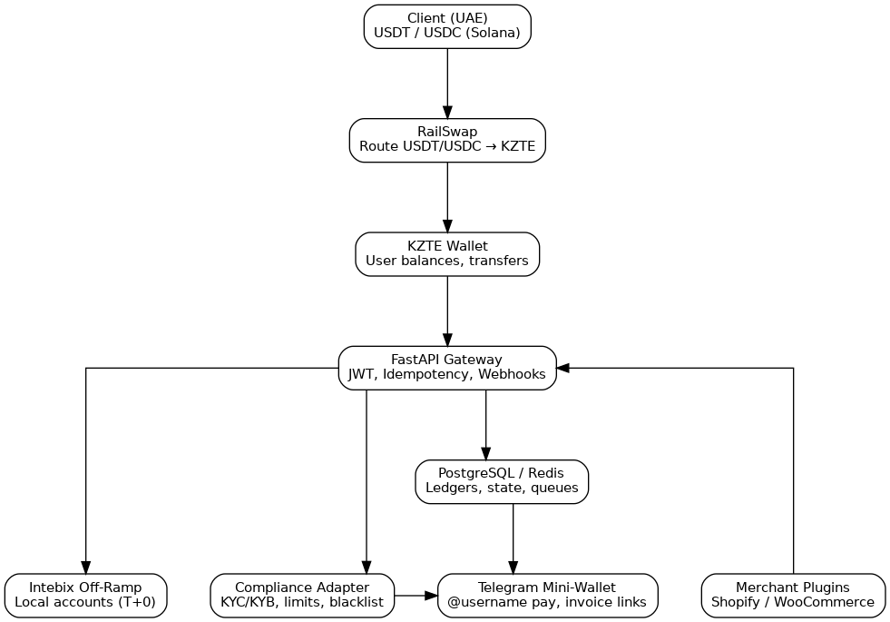

## KZTE RailHub – Real World Cross-Border Rails (KZ <-> UAE)
**Author:** Petros Lambropoulos

## Idea / Concept
**Executive Summary**  
KZTE RailHub turns Kazakhstan’s tenge-backed stablecoin (KZTE) into a working cross-border payment network between Kazakhstan and the UAE. Built on Solana and integrated with licensed issuers like Intebix and Eurasian Bank, it provides instant, compliant settlements, escrow-based B2B payments, and developer-ready APIs. The project bridges fiat and blockchain for tenge-denominated commerce, extending Kazakhstan’s digital payment success globally.

**Problem**  
Kazakh freelancers and SMEs face slow, costly, and opaque international payments. Domestic apps like Kaspi dominate locally but stop at Kazakhstan’s borders. Current USD or USDT transfers take 3–5 days and lose 3–5% in fees. KZTE offers a regulated stablecoin alternative but lacks real integrations, liquidity, and practical adoption.

**Solution**  
RailHub is a modular settlement gateway that converts USDC or USDT to KZTE via Solana liquidity pools. It enables milestone-based B2B settlements with escrow and invoicing through a FastAPI gateway. A compliance adapter enforces KYC/KYB, transaction caps, and hashed receipts. Telegram mini-wallets and SDKs make KZTE accessible to users and developers alike.

**Architecture Overview**  
Wallet adapters connect through the RailHub gateway (FastAPI + PostgreSQL), Solana programs enforce escrow instructions with idempotent webhooks, compliance adapters log hashed invoices and KYB/KYC proofs, and issuer integrations mint or burn KZTE while monitoring services publish tamper-proof receipts for partners. The schematic below walks through the data flow: contracts ingest instructions, escrow logic routes through Solana programs, compliance adapters hash every receipt, monitoring services publish audit logs, and issuer services handle mint/burn actions via bank rails.

The left rail represents user-facing interfaces (wallets, Telegram bots, dashboards) that sign escrow requests and forward them through authenticated FastAPI services. The center rail captures how Solana programs manage state channels, run milestone logic, and emit webhooks that keep the Postgres ledger synchronized and idempotent. The right rail shows compliance adapters enriching each transfer with KYB/KYC attestations before issuer and banking partners complete mint/burn operations and acknowledgements get streamed to monitoring dashboards for SMEs, regulators, and auditors.

{ width=95% }

*Figure 1: Wallets sign escrow instructions, FastAPI services route them into Solana settlement programs, compliance adapters sync hashed invoices + KYB proofs into PostgreSQL, observability hooks stream tamper-proof receipts, and issuer bridges mint or burn KZTE against fiat reserves while dashboards consume the shared telemetry.* 

## Prototype / Project
**Example Use Case**  
A Dubai client pays a Kazakh designer 500 USDT. RailHub converts it into KZTE, holds it in escrow, and releases it once milestones are approved. The designer receives KZTE instantly and off-ramps to tenge within hours. A 3–5% fee and multi-day delay become real-time settlement under 1%.

**Regulatory Alignment and Roadmap Fit**  
- **Phase 1 (Now):** Operates under AFSA’s sandbox with licensed issuers. Enables KZTE minting, escrow testing, mock off-ramps, and audit-ready compliance flows.  
- **Phase 2 (2025–2026):** Integrates with licensed merchants and payment processors. RailHub’s APIs bridge blockchain settlement with bank rails.  
- **Phase 3 (Beyond 2026):** Expands to cross-border corridors (UAE, Turkey, EU) with full SDK rollout and liquidity scaling.

**Why UAE First**  
The UAE is Kazakhstan’s key regional trade partner (~$1B in 2023). Regulatory alignment between AFSA and UAE’s ADGM/DIFC makes it ideal for compliant pilots. SMEs already serve UAE-based clients, providing a ready corridor for KZTE adoption.
## Research / Analytics
**Kazakhstan’s Cashless Leap**  
Cashless payments exceed 85% of total transactions, driven by the National Bank’s digitalization strategy, instant payment systems, and the success of Kaspi.kz. Every adult has access to digital ID and mobile banking, providing a perfect foundation for blockchain finance.

**The Kaspi Effect**  
Over 90% of adults use Kaspi monthly for payments, credit, and shopping. Kaspi turned tenge into a digital asset domestically but remains a closed system. KZTE builds on this success, offering the same instant experience across borders with full transparency and programmability.

**Why KZTE Is Needed Beyond Kaspi**  
Kaspi’s efficiency ends at Kazakhstan’s borders. It lacks cross-border capabilities, public auditability, and developer access. KZTE introduces an open, programmable, and global payment layer that complements Kaspi rather than competes with it.

**Market and Adoption Data**  
- Outbound remittances: $2.8B (2023)  
- Trade with UAE: $0.9B and growing  
- Average remittance fees: 3–6%  
- KZTE RailHub potential: <1% fees, sub-second settlement  

**Conclusion**  
RailHub aligns perfectly with Kazakhstan’s financial modernization goals. It offers regulators proof of safe blockchain settlements, businesses instant liquidity, and developers an open tenge-based payment rail. It’s the bridge between the national stablecoin and real-world adoption.

**Future Vision**  
In later phases, RailHub’s APIs can power agent-driven treasury and compliance automation—enabling AI agents to manage stablecoin liquidity, release escrow, and generate reports within guardrailed, human-approved policies.
